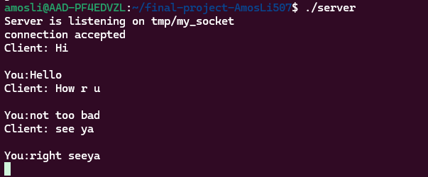
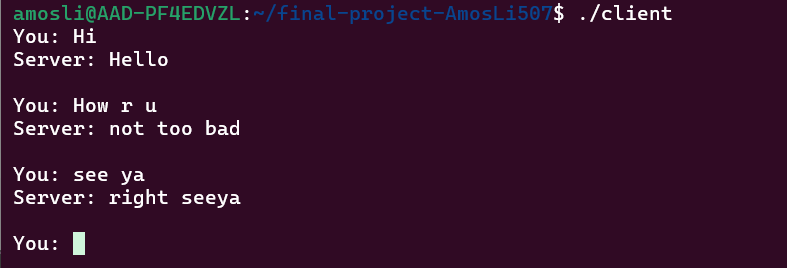

* Final Project - Chat Program between Two Terminals
*** CPE 2600-121
*** Amos(Mohan) Li
*** Lab 13
  
  **Description
  This project has two source file, compiling them to get two executables server and client. We have to run server first and then run client in another terminal. Server and client can chat with each others in two terminals.
  The server and client must chats one-by-one, each user cannot send two messages at the same time.

  Examples:
  
  
